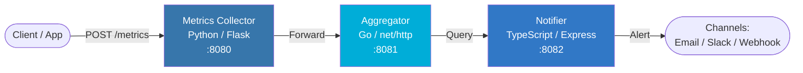

# PulseAPI

Real-time metrics aggregation and notification platform built with a microservice architecture.

PulseAPI collects application metrics, aggregates them in real time, and triggers alert notifications based on configurable rules. Built with **Python**, **Go**, and **TypeScript** to demonstrate polyglot microservice design.

## Architecture



### Services

| Service | Language | Port | Description |
|---------|----------|------|-------------|
| **metrics-collector** | Python (Flask) | 8080 | Receives and stores raw metric data points |
| **aggregator** | Go (net/http) | 8081 | Aggregates metrics (sum, avg, min, max, count) |
| **notifier** | TypeScript (Express) | 8082 | Evaluates alert rules and dispatches notifications |

## Quick Start

### Prerequisites

- Docker & Docker Compose
- (Optional for local dev) Python 3.12+, Go 1.22+, Node.js 20+

### Setup

```bash
# Clone the repository
git clone https://github.com/mohadayo/pulse-api.git
cd pulse-api

# Copy environment config
cp .env.example .env

# Start all services
make up

# Check health
make health
```

### Run Tests

```bash
# All tests
make test

# Individual services
make test-python
make test-go
make test-ts

# Linting
make lint
```

## API Reference

### Metrics Collector (`:8080`)

| Method | Endpoint | Description |
|--------|----------|-------------|
| `GET` | `/health` | Health check |
| `POST` | `/metrics` | Submit a metric data point |
| `GET` | `/metrics` | List metrics (optional `?name=` filter) |
| `POST` | `/metrics/flush` | Clear all stored metrics |

**POST /metrics** request body:
```json
{
  "name": "cpu_usage",
  "value": 72.5,
  "tags": { "host": "server-1", "region": "us-east" }
}
```

### Aggregator (`:8081`)

| Method | Endpoint | Description |
|--------|----------|-------------|
| `GET` | `/health` | Health check |
| `POST` | `/ingest` | Ingest a metric for aggregation |
| `GET` | `/aggregate` | Get aggregated stats (optional `?name=` filter) |
| `POST` | `/reset` | Clear aggregation store |

**GET /aggregate?name=cpu_usage** response:
```json
{
  "name": "cpu_usage",
  "count": 150,
  "sum": 10875.5,
  "avg": 72.5,
  "min": 12.0,
  "max": 99.8
}
```

### Notifier (`:8082`)

| Method | Endpoint | Description |
|--------|----------|-------------|
| `GET` | `/health` | Health check |
| `POST` | `/rules` | Create an alert rule |
| `GET` | `/rules` | List all alert rules |
| `POST` | `/evaluate` | Evaluate a metric value against rules |
| `GET` | `/notifications` | Get notification history |

**POST /rules** request body:
```json
{
  "metricName": "cpu_usage",
  "threshold": 90,
  "operator": "gt",
  "channel": "slack"
}
```

Supported operators: `gt`, `lt`, `gte`, `lte`, `eq`

**POST /evaluate** request body:
```json
{
  "metricName": "cpu_usage",
  "value": 95
}
```

## Usage Example

```bash
# 1. Submit a metric
curl -X POST http://localhost:8080/metrics \
  -H "Content-Type: application/json" \
  -d '{"name": "cpu_usage", "value": 85.5}'

# 2. Ingest into aggregator
curl -X POST http://localhost:8081/ingest \
  -H "Content-Type: application/json" \
  -d '{"name": "cpu_usage", "value": 85.5}'

# 3. Create an alert rule
curl -X POST http://localhost:8082/rules \
  -H "Content-Type: application/json" \
  -d '{"metricName": "cpu_usage", "threshold": 80, "operator": "gt", "channel": "email"}'

# 4. Evaluate and trigger alerts
curl -X POST http://localhost:8082/evaluate \
  -H "Content-Type: application/json" \
  -d '{"metricName": "cpu_usage", "value": 95}'

# 5. Check notifications
curl http://localhost:8082/notifications
```

## Environment Variables

| Variable | Default | Description |
|----------|---------|-------------|
| `COLLECTOR_PORT` | `8080` | Host port for metrics-collector |
| `AGGREGATOR_PORT` | `8081` | Host port for aggregator |
| `NOTIFIER_PORT` | `8082` | Host port for notifier |
| `LOG_LEVEL` | `INFO` | Logging verbosity |

## CI/CD

GitHub Actions workflow runs on every push and PR to `main`:
1. Python: flake8 lint + pytest
2. Go: go vet + go test
3. TypeScript: ESLint + Jest
4. Docker Compose build verification

> **Note:** The `.github/workflows/ci.yml` file may need to be manually added after initial repository setup due to GitHub API restrictions on the `.github/` directory.

## Makefile Commands

| Command | Description |
|---------|-------------|
| `make up` | Build and start all services |
| `make down` | Stop all services |
| `make build` | Build Docker images |
| `make test` | Run all tests |
| `make lint` | Run all linters |
| `make logs` | Tail service logs |
| `make health` | Check all health endpoints |
| `make clean` | Remove containers, images, and build artifacts |

## License

MIT
